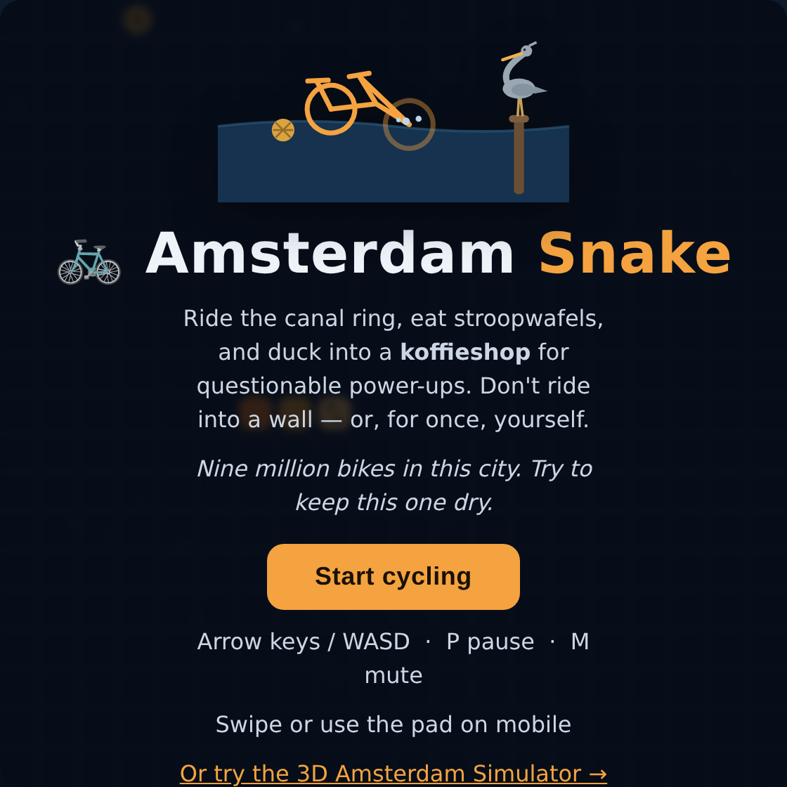

# 🚲 Amsterdam Project

Two browser games about the only city where the canals eat bicycles. No build
step, no backend, no `npm install` — plain static files that run fully offline.

- 🐍 **Amsterdam Snake** (`index.html`) — classic snake, but you're a bike, the
  food is stroopwafels, and the walls are canals. Ride into a **koffieshop** to
  spend your stroopwafels on power-ups (Espresso Shot, Space Cake, Ghost Bike,
  Straighten Out). Comes with particle effects (crumb bursts, canal splashes,
  ambient glints) and a procedural Web Audio soundtrack — no audio files, all
  synthesised in-browser. Keyboard, swipe, or on-screen D-pad, so it plays on
  phones. Add `?dev` to the URL for a small tinkering/debug hook.
- 🚲 **Amsterdam Simulator** (`simulator.html`) — a procedurally generated 3D
  canal district built with Three.js: leaning gabled houses, bridges, boats, a
  tram with right of way, city buses with a QR scanner that works exactly half
  the time, a fully neon De Wallen, and weather that is legally required to
  include drizzle.


<p align="center">
  
  <br />
  <em>Pictured: a bike in a canal, and a heron who has watched this happen many, many times.</em>
</p>

## Play online

Hosted on GitHub Pages (static, no backend):

- Snake: <https://amongruenwald.github.io/AmsterdamProject/>
- Simulator: <https://amongruenwald.github.io/AmsterdamProject/simulator.html>

## Play locally

Static files, but the simulator's ES modules need a web server, so from the repo
root:

```bash
python3 -m http.server 8741
```

Then open <http://localhost:8741> (snake) or
<http://localhost:8741/simulator.html> (simulator).

Want a different city? Add a seed: `http://localhost:8741/simulator.html?seed=42`.

## Controls

| Key | Action |
|---|---|
| `W` / `S` | pedal / brake |
| `A` / `D` | steer |
| `SPACE` | ring bell (scatters nearby tourists) |
| `E` | scan QR ticket / board bus / request stop |
| `B` | rent / moor a canal sloop |
| `F` | eat at a snack cart |
| `T` | use a krul urinoir |
| `SHIFT` | sprint |
| `C` | toggle chase / overview camera |

## Gameplay

- 🧇 **Stroopwafels** — glowing, spinning, scattered along the quays. Ride
  through them. They respawn; happiness is renewable.
- 🔔 **The bell** — tourists drift into the fietspad. Ring within range and
  watch them scatter. The HUD keeps score.
- 💦 **The canals** — ride in and the water accepts your bike, as it accepts
  all bikes. You respawn on the quay; the splash counter remembers.
- 🌦 **Weather** — a Markov chain calibrated to the Dutch sky: sunny is a state
  you pass through, drizzle is a state you live in.
- 🌅 **Day/night** — a full day runs in 20 real minutes, from morning light to
  lamplit canals.
- 🚌 **The bus** — proper public transport on the outer roads, with stops,
  shelters, and a QR ticket scanner that accepts your ticket 50% of the time.
  This percentage was chosen after extensive field research and cannot be
  appealed. Board, ride, press `E` again to request your stop.
- ⛵ **Boat tours** — rent a sloop at a BOOT VERHUUR dock (`B`) and three
  tourists climb aboard expecting narration. You are the narration. Cruise the
  gracht and the commentary writes itself ("The canals are three metres deep:
  one metre water, one metre mud, one metre bicycles"), duck under the bridges
  ("Bruggetje! Everybody down"), deliver six facts, and moor at any dock to
  collect your tip — five stroopwafels, exact change. The ⛵ counter keeps score.
- 🌹 **De Wallen** — the red light district glows along one canal: flickering
  neon, velvet windows, red lanterns, string lights — and it's inhabited.
  Dancers sway in front of the windows (and now twirl when you're watching),
  kisses drift over the canal as heart particles — aimed at you, personally —
  and pink neon reflections breathe on the water. Cycle slowly past a window
  and the district notices: your 💋 counter climbs, and if you stay, it
  *compounds* — the streak lines escalate from flirty to municipal honours.
  The district also has its own soundtrack now: a slow, low, procedurally
  synthesised bass groove that fades in when you cross the border, like the
  neighbourhood is playing it just for you. Ringing your bell in De Wallen is
  understood by everyone as flirting. Silhouette-level tasteful throughout.
- 🍟 **Local cuisine (survival)** — you burn calories out there. Hunger (🍟)
  drains as you ride; hit zero and you get *de hongerklop* — the bonk — and
  crawl until you eat. Six snack carts serve the classics: Hollandse Nieuwe,
  patat oorlog, kroket uit de muur, poffertjes, bitterballen, and a cheese
  sample lap. Stroopwafels help a little too.
- 🚽 **The other meter** — what goes in must come out (🚽), and it rises on its
  own, because time comes for us all. Amsterdam provides its iconic dark-green
  krul urinoirs; learn where they are before you need them at 90%. At 100%,
  something happens behind a parked bakfiets that you will tell no one about.
  The heron sees everything.

## Tech

- [Three.js](https://threejs.org/) r160, vendored in `vendor/` — no CDN, no
  `npm install`, no bundler. Plain ES modules + an import map.
- Procedural city generation from a seeded RNG (mulberry32): canal grid,
  ~250 canal houses with canvas-generated facades, stepped and pointed gables,
  and the traditional structural forward lean.
- Simple 2D AABB collision; arcade bike physics; chase camera.

## Repository layout

```
index.html        🐍 Amsterdam Snake (self-contained: HTML + CSS + JS)
simulator.html    🚲 Amsterdam Simulator entry: HUD, splash, import map
src/main.js       bootstrap + game loop
src/city.js       procedural city generation + spatial queries
src/player.js     player bike, physics, camera
src/npcs.js       NPC cyclists, tourists, boats, tram
src/transit.js    buses, bus stops, the 50/50 QR scanner
src/cuisine.js    snack carts, krul urinoirs, hunger/bowel survival meters
src/wallen.js     De Wallen life: dancers, hearts, charm streaks, district muziek
src/boating.js    sloop rental docks, boat driving, narrated canal tours
src/weather.js    weather state machine, rain, day/night cycle
src/pickups.js    stroopwafels
vendor/           three.module.js (r160)
```
